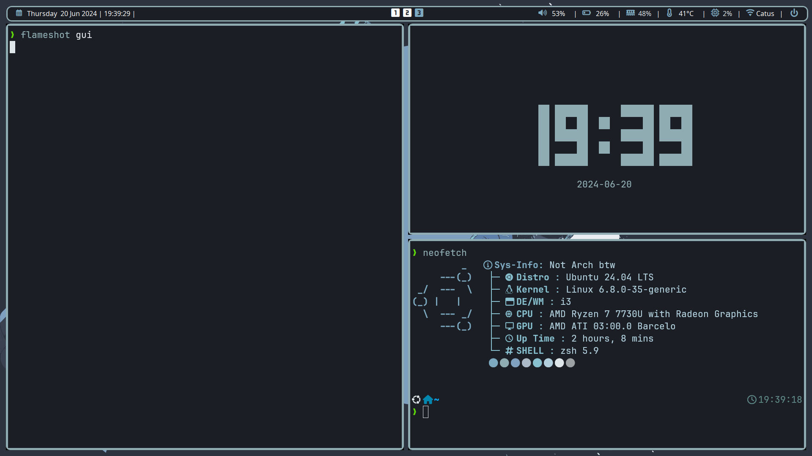
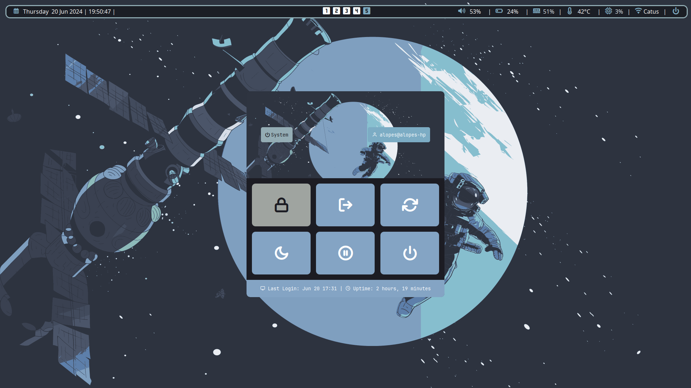
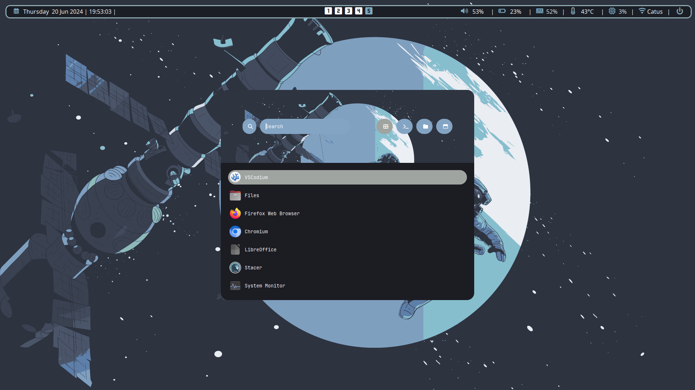
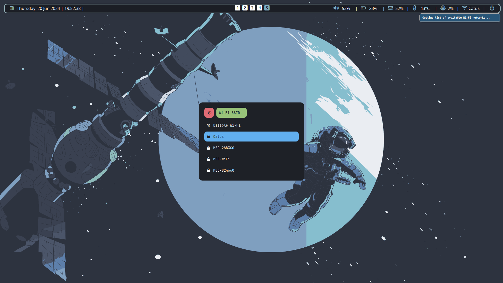

# Dotfiles
Hello everyone,
 Here are my config files of my Ubuntu i3WM machine.
 Keep in mind that some of the configs of rofi and neofetch are not mine,
the link to repos is inside the config file. Please check out the github owner themes (https://github.com/adi1090x/rofi) 
   
   
   ## Rice
   
  - **OS:** Ubuntu
  - **Window Manager:** [i3WM](./I3WM)
  - **Bar:** [Polybar](./Polybar)
  - **Launcher:** [Rofi](./Rofi)
  - **Compositor:** [Picom](https://github.com/yshui/picom)
  - **Terminal:** [Kitty](./Kitty)
  - **File Manager:** Rofi
  - [Neofetch](./Neofetch)
  - **Fonts:** font-awesome (Polybar),jetbrainsmono nerd fonts (Polybar,rofi and i3) and Symbols Nerd Font Mono (Polybar)
  - **Color scheme generator:** [Pywal](https://github.com/dylanaraps/pywal)
    **Zsh theme:** [Powerlevel10k](https://github.com/romkatv/powerlevel10k)
  
  ## Wallpaper 
  
 https://github.com/D3Ext/aesthetic-wallpapers
  
  ## Screenshots
 

Hope you like it!!
 Have a good day :)

